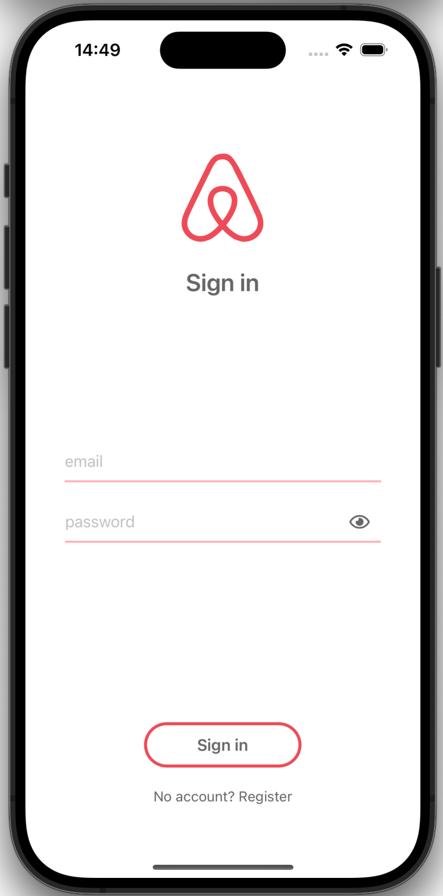
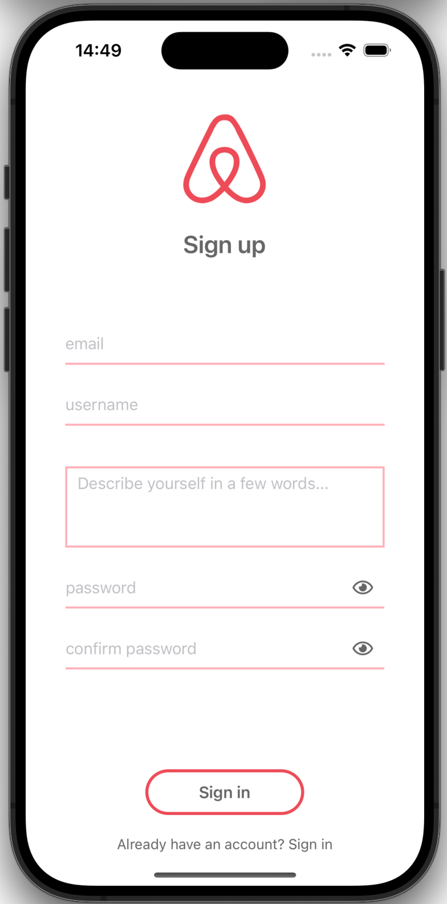
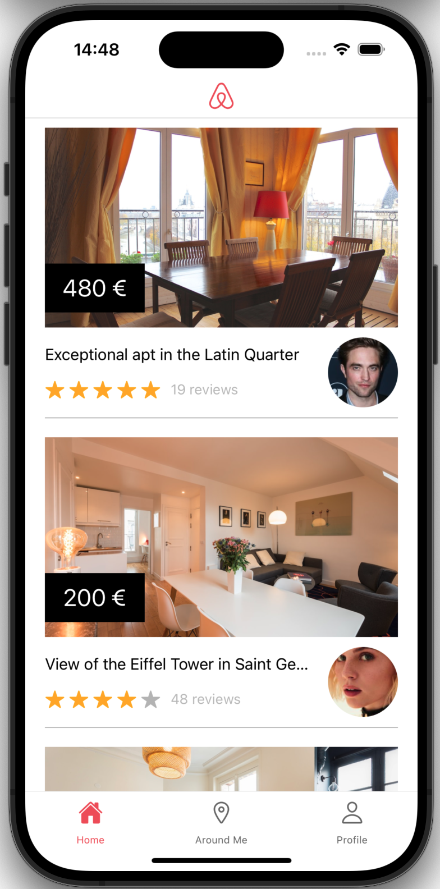
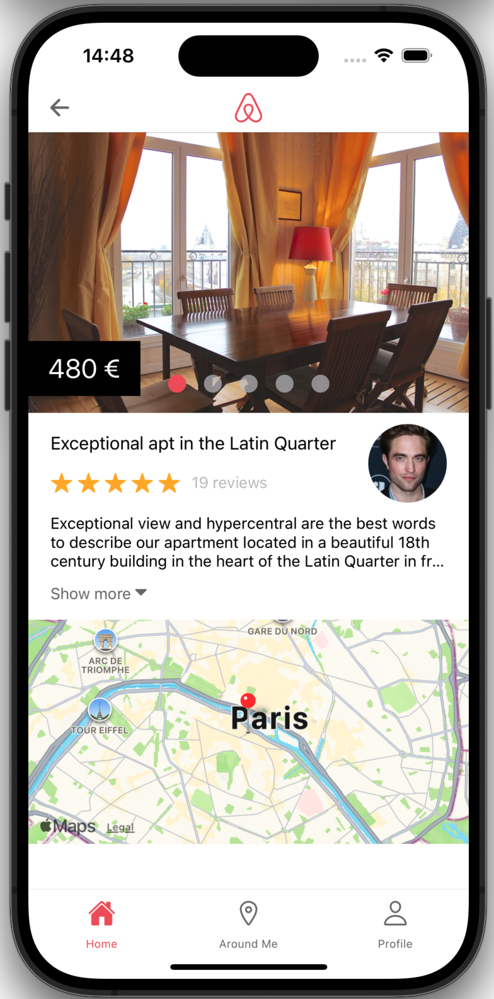
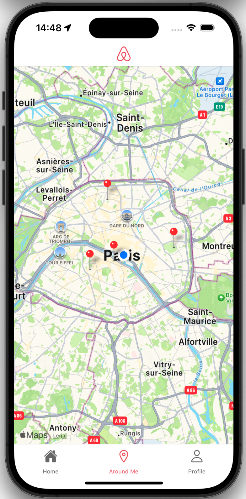
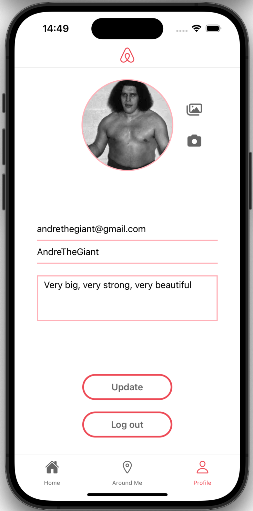

# Airbnb Clone App - Expo

---

<p align="center" ></p>

---

## Overview

This project is a simplified reproduction of the Airbnb app, realised during my formation at **Le Reacteur**.
Feel free to use it as a base for your presonnal projects.

The following screens are available in the app:

- Sign in
- Sign up
- Home
- Room
- Around Me
- Profile

---

## Screenshots

Sign in and sign up screens.

<p>


</p>

Screens available once user is logged.






---

## Installation and Use

Before starting, make sure that you have installed Expo according to the [documentation](https://docs.expo.dev/get-started/installation/).

This application works for both iOS and Android.

### Running the app

Clone the repository:

```
git clone XXX
cd XXX
```

Install the packages:

```
yarn
```

Once installation is complete, start the project:

```
yarn start
```

---

## Props

### Sign in

| Name       | Type   | Required | Description   | Example     |
| ---------- | ------ | -------- | ------------- | ----------- |
| `email`    | String | Yes      | User email    | abc@123.com |
| `password` | String | Yes      | User password | qwertz1234! |

### Sign Up

| Name          | Type   | Required | Description   | Example                     |
| ------------- | ------ | -------- | ------------- | --------------------------- |
| `email`       | String | Yes      | User email    | abc@123.com                 |
| `username`    | String | Yes      | User email    | John Doe                    |
| `description` | String | Yes      | User email    | I'm John Doe and I'm funny. |
| `password`    | String | Yes      | User password | qwertz1234!                 |
